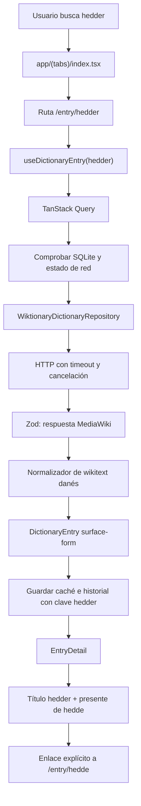

# Arquitectura de Dansk Dictionary

## Visión general

La aplicación es mobile-first y no necesita backend en el corte actual. El proveedor oficial se consulta desde el cliente porque no requiere clave privada. Sus respuestas nunca llegan directamente a componentes: primero se validan, después se transforman al modelo interno y finalmente se guardan como JSON normalizado con metadatos de procedencia.

```text
app/                              rutas y composición de pantallas
  (tabs)/                         Buscar, Favoritos, Historial, Información
  +native-intent.ts               validación previa de deep links nativos
  entry/[term].tsx                resultado exacto para la forma de la URL
src/
  components/                     piezas visuales reutilizables y accesibles
  features/
    dictionary/                   consulta, detalle y TTS
    favorites/                    lectura y escritura de favoritos
    history/                      lectura y borrado del historial
  domain/
    models/                       modelo lingüístico normalizado y errores
    repositories/                 puertos que los proveedores implementan
    services/                     normalización, navegación y conflictos
  infrastructure/
    api/                          HTTP, timeout, cancelación y validación
    providers/wiktionary/         contrato externo, adaptador y normalizador
    storage/                      migraciones y repositorios SQLite
  providers/                      composición de Query, SQLite y red
  constants/                      tokens de tema
  hooks/                          hooks transversales
__tests__/                        fixtures reales y tests offline
docs/                             arquitectura, datos, IPA, legal y decisiones
```

## Responsabilidad de cada capa

### Presentación y navegación

`app/` contiene rutas de Expo Router. No interpreta wikitext ni ejecuta SQL. La búsqueda solo normaliza el texto y navega a `/entry/[term]`; la ruta dinámica decide qué estado mostrar y delega el contenido a `EntryDetail`.

Expo Router convierte archivos en rutas. Esto hace que `/entry/hedder` sea una identidad observable y estable: la pantalla no cambia su parámetro por `hedde`. Los enlaces a lemas e inflexiones crean una ruta nueva con `buildEntryHref`, por lo que el botón Atrás recupera naturalmente la entrada anterior.

Antes de que Expo Router interprete un deep link nativo, `+native-intent.ts` limita su longitud y valida la codificación URI. Una ruta sobredimensionada o malformada vuelve a `/`; las rutas válidas se entregan sin modificar. Esta barrera mitiga la alerta transitiva documentada en `docs/dependency-security.md` sin cambiar la matriz de SDK 57.

### Funcionalidades

Cada carpeta de `src/features/` reúne hooks y componentes de un comportamiento de usuario:

- `dictionary`: ejecuta la consulta remota/local y presenta el dominio;
- `favorites`: mantiene el corazón y las listas guardadas;
- `history`: actualiza listas al enfocar la pantalla y permite eliminar;
- `information`: hoy es una ruta estática, sin estado propio.

No se añadió Zustand porque Query ya cubre estado remoto y cada estado visual es local al componente. Añadir otra fuente global sería duplicar responsabilidades.

### Dominio

`DictionaryEntry` representa la forma consultada, no solo el lema. Contiene una o varias unidades gramaticales para homógrafos, relaciones forma-lema, pronunciaciones, sentidos, traducciones, flexiones, ejemplos, audio, atribuciones y conflictos.

`ProviderFact<T>` enlaza un valor con identificadores de atribución y distingue evidencia de fuente, normalizada, editorial, sintética o inferida. `DataAttribution` conserva proveedor, URL, licencia, revisión, fecha y método. La UI puede así mostrar el origen sin conocer MediaWiki.

### Infraestructura y proveedores externos

`WiktionaryDictionaryRepository` implementa el puerto `DictionaryRepository`. Construye llamadas a MediaWiki Action API con CORS, solicita wikitext/revisión y usa OpenSearch solo si no hay coincidencia exacta. `getValidatedJson` aplica timeout, cancelación, estados HTTP y un esquema Zod.

`wiktionary-normalizer.ts` extrae exclusivamente la sección danesa, separa categorías gramaticales, interpreta plantillas admitidas y produce el dominio. Un campo que el parser no puede verificar queda ausente. El contenido editorial está separado en `editorial-content.ts` y siempre se etiqueta como traducción o ejemplo propio.

### Almacenamiento

SQLite es la fuente persistente para tres conjuntos:

- `entry_cache`: entrada normalizada, fechas, revisión, proveedor y versión de esquema;
- `history`: clave exacta, forma visible, tipo y última consulta;
- `favorites`: clave exacta, tipo, fecha y snapshot de la entrada.

TanStack Query no reemplaza SQLite: mantiene el estado remoto en memoria, deduplica consultas, cancela y limita reintentos. SQLite mantiene la copia durable. Al reiniciar la app, la siguiente consulta intenta renovar desde internet y usa SQLite si falla o si el dispositivo está offline. La caché no se escribe dos veces en formatos diferentes: guarda el mismo `DictionaryEntry` que consume la UI.

## Recorrido completo de `hedder`



1. La pantalla inicial produce `buildEntryHref('hedder')` y no busca primero el lema.
2. Expo Router conserva `hedder` como parámetro de la ruta.
3. TanStack Query usa `['dictionary-entry', 'hedder']`; `hedde` tendría otra clave.
4. El hook comprueba SQLite y el estado online. Con red intenta renovar; sin red usa la copia local.
5. El repositorio llama `action=parse&page=hedder&prop=wikitext|revid`.
6. Zod rechaza respuestas sin `pageid`, `revid` o wikitext válido.
7. El normalizador detecta `{{infl of|da|hedde||pres}}`, crea `entryKind: surface-form` y una `FormRelation` a `hedde`.
8. La fuente no aporta IPA de `hedder`; la lista queda vacía. No se consulta ni copia la IPA de `hedde`.
9. Se adjunta el ejemplo pedagógico propio y TTS sintético identificado.
10. SQLite guarda caché, historial y favorito bajo `hedder`. La interfaz muestra el título original.
11. Pulsar `hedde` abre otra ruta. Desde su flexión presente, pulsar `hedder` vuelve a la entrada exacta.

## Formas, lemas y homógrafos

`DictionaryEntry.entryKind` describe la identidad principal de la consulta. Cada `GrammaticalUnit` tiene también su tipo, porque una grafía puede ser lema en una categoría y forma en otra. Por ejemplo, `hus` contiene un sustantivo lema y también un imperativo verbal relacionado con `huse`; la entrada global sigue siendo navegable como `hus` y conserva ambas unidades.

`FormRelation` contiene lema, categoría, etiqueta de relación, rasgos y atribución. `Inflection` contiene la forma navegable en sentido inverso. No se reemplaza ningún texto: navegar siempre es una acción explícita.

## Combinación, prioridad y conflictos

El primer corte tiene un proveedor léxico externo y un proveedor editorial local. Wiktionary tiene prioridad para hechos léxicos; el editorial aporta traducciones y ejemplos en huecos definidos, no sobrescribe IPA ni gramática.

`selectPreferredFact` es la política inicial para cuando existan dos valores comparables. Deduplica valores idénticos; si difieren selecciona según la prioridad declarada y crea `DataConflict` con todos los candidatos. Una futura UI podrá mostrarlos por separado. Nunca concatena valores incompatibles.

Para añadir otro proveedor se debe decidir por campo si complementa, compite o solo sirve de respaldo. La procedencia viaja en `attributionIds`, de modo que una acepción, IPA o traducción puede citar fuentes distintas.

## Estado remoto, local, offline y errores

- `QueryClient` conserva datos un día como frescos en memoria y los recolecta tras siete días sin uso.
- `expo-network` alimenta `onlineManager`; AppState alimenta `focusManager`.
- Cada fetch dispone de señal de cancelación y timeout de ocho segundos.
- Se realiza como máximo un reintento automático.
- HTTP 429, timeout, red, formato inválido y almacenamiento tienen códigos diferenciados.
- Si una consulta falla y existe caché, se devuelve la caché; si expiró aparece un aviso de obsolescencia.
- Una ausencia exacta presenta sugerencias y nunca navega automáticamente.
- La licencia CC BY-SA permite conservar el contenido con atribución; la expiración de siete días es una política de frescura, no una eliminación de autoría.

## Audio

La versión actual usa `expo-speech`. Antes de hablar detiene cualquier TTS previo para evitar superposición. Cada control identifica voz sintética, locale y velocidad; gestiona finalizar, detener, error y reintento. No se integró todavía audio humano porque el primer proveedor no ofrece en este flujo un archivo con licencia y autoría verificadas. El dominio `AudioSource` ya distingue grabación humana de TTS para crecer sin cambiar la UI conceptual.

## Pruebas

Los tests Jest no acceden a internet. `__tests__/fixtures/wiktionary-pages.ts` contiene fragmentos reales con pageid/revid. Las suites cubren:

- contrato externo válido e inválido;
- género `et`, flexiones y homógrafos de `hus`;
- lema `hedde` y forma independiente `hedder`;
- ausencia deliberada de IPA de `hedder`;
- navegación bidireccional mediante rutas exactas;
- múltiples acepciones, categorías y pronunciaciones;
- página sin sección danesa;
- caché vigente, obsoleta, ausente y malformada;
- claves separadas para caché, historial y favoritos;
- instalación limpia, migración v1→v2 y reapertura a nivel de política;
- carga online, recuperación desde caché y ausencia offline accionable;
- deep links nativos válidos, malformados y sobredimensionados;
- semántica, áreas táctiles y contraste de los componentes compartidos;
- borrado selectivo mediante SQL parametrizado;
- registro de conflictos.

Jest cubre contratos y políticas puras con dobles de `SQLiteDatabase`. El diagnóstico opt-in de
`docs/android-storage-validation.md` usa bases temporales para comprobar SQLite nativo en Android:
creación, reapertura, CRUD por clave, migración con datos y respaldo de esquemas incompatibles.
La checklist de `docs/android-accessibility-validation.md` completa lo automatizable con TalkBack,
texto al 200 %, temas y estados reales en Android.

## Decisiones principales

- No backend: no hay clave que proteger ni carga que justifique operación de servidor.
- Wikitext en lugar de HTML remoto: permite validar y normalizar datos sin ejecutar HTML.
- Modelo rico antes que DTO de pantalla: evita acoplar el crecimiento lingüístico al proveedor inicial.
- SQLite como persistencia y Query como estado remoto: una sola representación durable, sin dos cachés persistentes rivales.
- Contenido editorial estático: ejemplos pedagógicos revisables y testeables, sin IA opaca en producción.
- RNTL 13.3.3: base estable de pruebas de componentes, validada con React 19.2.3 y Jest Expo 57.

## Extensiones preparadas

### Añadir un proveedor

1. Crear su esquema Zod y tipos en `src/infrastructure/providers/<proveedor>/`.
2. Implementar `DictionaryRepository` o un puerto más específico.
3. Transformar exclusivamente a `DictionaryEntry`; no exponer DTO externos.
4. Añadir `DataAttribution` y conservar licencia/revisión por hecho.
5. Incorporarlo a un repositorio agregador con prioridad y `DataConflict`.
6. Añadir fixtures reales offline y casos de caída/datos parciales.
7. Actualizar `docs/data-sources.md` y `docs/legal-and-licenses.md`.

### Añadir un campo lingüístico

1. Extender el tipo más próximo en `domain/models/dictionary.ts`.
2. Añadirlo al normalizador solo con evidencia verificable.
3. Actualizar la validación de caché y, si cambia el JSON, incrementar `schemaVersion`.
4. Presentarlo con su atribución y estado ausente.
5. Añadir pruebas para múltiples valores y conflictos.

### Añadir una pantalla

1. Crear el archivo de ruta en `app/`.
2. Mantener consulta/estado en un hook de `src/features/`.
3. Añadirla al layout de Stack o Tabs solo si debe ser navegación primaria.
4. Usar componentes/tokens existentes y probar accesibilidad y estados vacíos.

### Añadir una migración SQLite

1. Incrementar `DATABASE_VERSION`.
2. Leer `PRAGMA user_version` y aplicar solo pasos posteriores a la versión instalada.
3. Ejecutar la migración dentro de `withTransactionAsync`.
4. Usar parámetros para datos del usuario; `execAsync` solo para SQL estático.
5. Actualizar `PRAGMA user_version`, añadir una prueba y documentar compatibilidad hacia atrás.

La versión 2 repara instalaciones tempranas cuyo esquema v1 usaba una clave anterior en vez de
`query`. Si reconoce la columna (`term`, `search_term`, `normalized_term` o `word`), la renombra y
conserva todos los registros. Si la tabla no tiene las demás columnas requeridas, la conserva con
el sufijo `_legacy_v1` y crea una tabla vigente para que la aplicación pueda iniciar sin destruir el
contenido anterior.

## Limitaciones actuales

- La extracción cubre plantillas danesas comunes, no toda la gramática de Wiktionary.
- Las flexiones nominales navegables están verificadas explícitamente para `hus` y `dag`; otras aparecen solo si se pueden normalizar sin inferencias dudosas.
- No hay traducción automática ni búsqueda inversa.
- No hay audio humano integrado; la disponibilidad y licencia deben evaluarse archivo por archivo.
- No se interpreta todavía etimología compleja ni tablas expandidas por plantillas.
- La matriz de dispositivos sigue siendo acotada: TTS se validó en un Xiaomi 14T Pro y SQLite/TTS
  en un AVD Android 16. Conviene repetir el protocolo al cambiar Expo, Android o el esquema.
- `npm audit --omit=dev` conserva una alerta moderada transitiva representada en tres filas; la
  exposición, mitigación y reevaluación están en `docs/dependency-security.md`.

## Tabla de archivos esenciales

| Ruta                                                               | Responsabilidad               | Utilizado por                 | Modificar cuando…                             |
| ------------------------------------------------------------------ | ----------------------------- | ----------------------------- | --------------------------------------------- |
| `app/_layout.tsx`                                                  | Providers y Stack raíz        | toda la app                   | cambie un provider global o una ruta de Stack |
| `app/+native-intent.ts`                                            | valida deep links nativos     | Expo Router en Android        | cambie el esquema o la política de enlaces    |
| `app/(tabs)/_layout.tsx`                                           | navegación primaria           | cuatro tabs                   | se añada/quite una sección principal          |
| `app/(tabs)/index.tsx`                                             | búsqueda exacta y recientes   | usuario, historial            | cambie la experiencia de búsqueda             |
| `app/entry/[term].tsx`                                             | estados de la consulta        | hook y detalle                | cambien carga/error/sugerencias               |
| `src/domain/models/dictionary.ts`                                  | lenguaje ubicuo               | normalizadores, DB, UI, tests | se añada una capacidad lingüística            |
| `src/domain/repositories/dictionary-repository.ts`                 | puerto de consulta            | proveedor                     | cambie el contrato independiente de proveedor |
| `src/domain/services/dictionary-policy.ts`                         | normalización/prioridad       | búsqueda y agregación         | cambie deduplicación o conflictos             |
| `src/features/dictionary/hooks/use-dictionary-entry.ts`            | adapta TanStack Query         | ruta de entrada               | cambie la integración React/Query             |
| `src/features/dictionary/services/load-dictionary-entry.ts`        | decide entre red y caché      | hook y tests                  | cambie la política online/offline             |
| `src/features/dictionary/components/entry-detail.tsx`              | presenta el dominio           | ruta de entrada               | cambie jerarquía visual o accesibilidad       |
| `src/infrastructure/api/http-client.ts`                            | HTTP seguro validado          | proveedores                   | cambien timeout, headers o errores            |
| `src/infrastructure/providers/wiktionary/wiktionary-schema.ts`     | valida DTO externo            | repositorio Wiktionary        | cambie la API de MediaWiki                    |
| `src/infrastructure/providers/wiktionary/wiktionary-normalizer.ts` | wikitext → dominio            | repositorio y tests           | se soporte una plantilla/campo nuevo          |
| `src/infrastructure/providers/wiktionary/editorial-content.ts`     | traducciones/ejemplos propios | normalizador                  | se revise contenido pedagógico                |
| `src/infrastructure/providers/wiktionary/wiktionary-repository.ts` | integración API y sugerencias | hook de consulta              | cambie endpoint/proveedor                     |
| `src/infrastructure/storage/database.ts`                           | esquema, migración y CRUD     | hooks y providers             | cambie persistencia o versión de esquema      |
| `src/infrastructure/storage/database-diagnostics.ts`               | prueba SQLite nativo aislado  | diagnóstico opt-in            | cambie el esquema o su protocolo Android      |
| `src/providers/app-providers.tsx`                                  | Query, SQLite, red y foco     | layout raíz                   | cambie configuración global                   |
| `__tests__/fixtures/wiktionary-pages.ts`                           | respuestas reales recortadas  | tests de proveedor            | se añada un patrón real nuevo                 |
| `docs/data-sources.md`                                             | disponibilidad/licencia       | mantenimiento legal           | se integre o descarte una fuente              |
| `docs/android-accessibility-validation.md`                         | protocolo accesible Android   | QA manual de pantallas        | cambie navegación, estados o componentes      |
